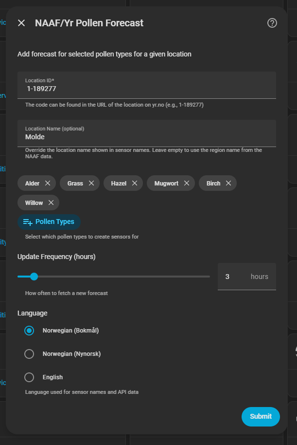
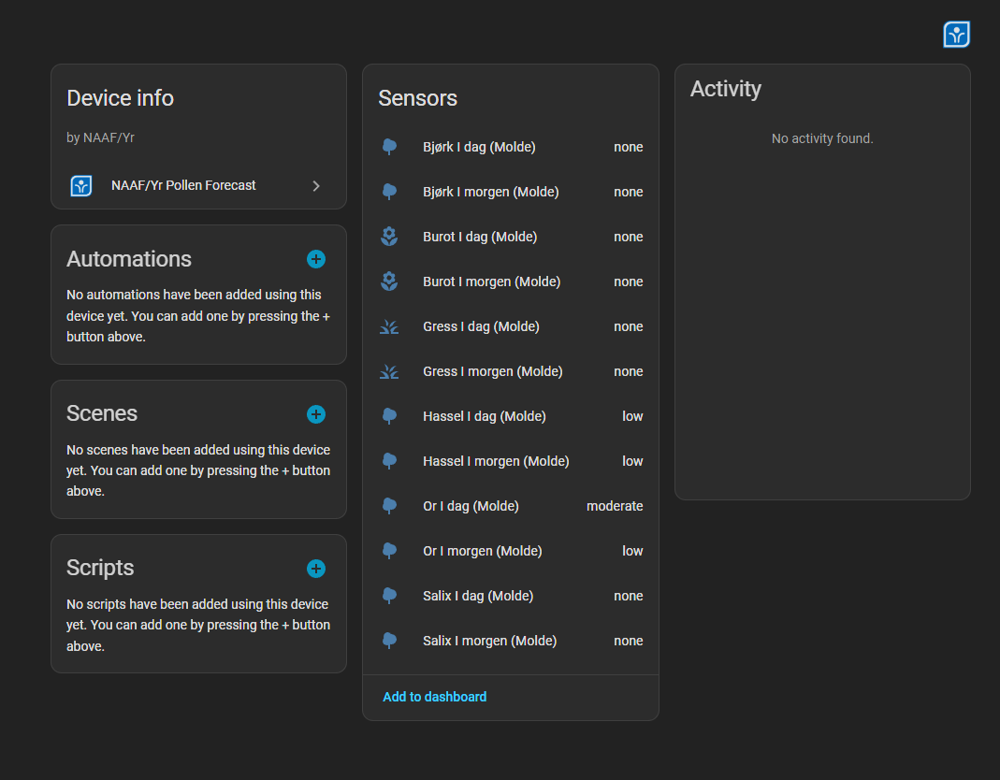
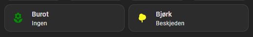

# Home Assistant Pollen Forecast Integration (Pollenvarsling)

A custom Home Assistant integration for displaying Norwegian pollen forecasts from NAAF (Norwegian Asthma and Allergy Association), based on Yr's location codes.

## Installation

### Via HACS (Recommended)
1. Go to HACS > Integrations
2. Search for **NAAF/Yr Pollen Forecast** and install it

### Manual
Copy the `custom_components/pollenvarsel_naaf_yr` folder to your `custom_components` directory in Home Assistant.

## Configuration

Configuration is done through the Home Assistant UI — no `configuration.yaml` editing required.

1. Go to **Settings > Devices & Services**
2. Click **+ Add Integration**
3. Search for **Pollenvarsel** and select it
4. Fill in the form:

### Configuration


- **Location ID** (required): The Yr location ID. The code can be found in the URL of the location on yr.no (see [Finding Location IDs](#finding-location-ids) below).
  > ℹ️: Only locations in mainland Norway will work.

- **Location Name** (optional): Override the name shown in sensor names. Leave empty to use the region name from the NAAF data.

- **Pollen Types** (required): Select which pollen types to create sensors for. Available types:
  - Hazel (Hassel)
  - Alder (Or)
  - Salix (Salix)
  - Birch (Bjørk)
  - Grass (Gress)
  - Mugwort (Burot)

- **Update Frequency** (optional): How often to fetch a new forecast, in hours. Default: `3`

- **Language** (optional): Language used for sensor names and API data. Default: Norwegian bokmål
  - Norwegian bokmål
  - Norwegian nynorsk
  - English

## Finding Location IDs

Visit https://www.yr.no/nb and search for your location. The location ID is in the URL, located after `daglig-tabell`:

`https://www.yr.no/nb/værvarsel/daglig-tabell/{locationID}/Norge/{otherNonRelevantLocationInfo}`

> Example:
>
> `https://www.yr.no/nb/værvarsel/daglig-tabell/1-189277/Norge/Møre%20og%20Romsdal/Molde/Molde`
>
> where `1-189277` is the ID.


## Sensors Created


For each pollen type and location, the integration creates two sensors:
- `sensor.pollen_{pollen_type}_{location_name}_today` or `sensor.pollen_{pollen_type}_{region_name}_today`
- `sensor.pollen_{pollen_type}_{location_name}_tomorrow` or `sensor.pollen_{pollen_type}_{region_name}_tomorrow`

### Sensor States
- `none` - Pollen type not forecast for that day
- `low` - Low pollen level
- `moderate` - Moderate pollen level
- `severe` - Severe pollen level
- `extreme` - Extreme pollen level
> ℹ️ The integration was set up before anything was highly in bloom - these values need to be verified as the season progresses.  

### Sensor Attributes
- `pollen_name` - Localized name of the pollen type (e.g., "Hassel" in nb, "Hazel" in en)
- `level_name` - Localized distribution level name (e.g., "Beskjeden", "Moderat")
- `level_color` - Suggested icon color for the current level (see [Dashboard Coloring](#dashboard-coloring))
- `date` - Forecast date
- `region_name` - Region name fetched from the API
- `location_name` - Custom name as set in the configuration, if present
- `last_updated` - Date & time for when the sensor was last updated

## Dashboard Coloring

Home Assistant does not color `sensor` icons based on their state natively, so the
integration exposes a `level_color` attribute holding a suggested color for the
current level (green/yellow/orange/red/purple). You can consume it in a dashboard using [card-mod](https://github.com/thomasloven/lovelace-card-mod) (HACS).

The example below uses the `level_color` attribute as the **default**, while
letting users override any level with their own colors via a theme variable:

```yaml
type: tile
entity: sensor.pollen_birch_molde_today
state_content: level_name
card_mod:
  style: |
    ha-tile-icon {
      --tile-color: var(
        --pollen-{{ states(config.entity) }}-color,
        {{ state_attr(config.entity, 'level_color') }}
      );
    }
```


- `state_content: level_name` shows the localized level (e.g. "Beskjeden") instead of the raw state.
- If the user defines a matching theme variable (e.g. `--pollen-low-color`), it takes priority.
- Otherwise it falls back to the integration's default `level_color`.

To override the defaults, add the variables to any theme:

```yaml
# themes.yaml
my_theme:
  pollen-none-color: "#607D8B"
  pollen-low-color: "#8BC34A"
  pollen-moderate-color: "#FFC107"
  pollen-severe-color: "#FF5722"
  pollen-extreme-color: "#E91E63"
```

## Automation Example

```yaml
automation:
  - alias: "High Pollen Alert"
    trigger:
      - platform: state
        entity_id: sensor.pollen_birch_molde_today
        to: "severe"
      - platform: state
        entity_id: sensor.pollen_birch_molde_today
        to: "extreme"
    action:
      - service: notify.mobile_app_phone
        data:
          message: "High birch pollen today!"
```

## Troubleshooting

If sensors don't appear:
1. Restart Home Assistant after installing the integration
2. Check that the location ID is correct (see [Finding Location IDs](#finding-location-ids))
3. Check Home Assistant logs for errors

### Changing configuration

The integration does not currently support editing settings after setup. To change pollen types, language, or update frequency, delete the integration entry under **Settings > Devices & Services** and re-add it.
